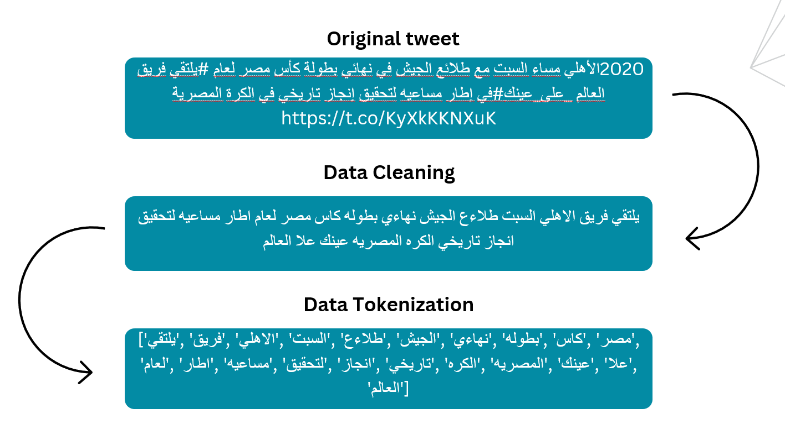

# Sarcasm Detection from Arabic Tweets

This project focuses on developing and training multiple machine and deep learning models to identify sarcasm in Arabic tweets. Our goal is to enhance natural language processing capabilities for the Arabic language, dealing with diverse dialects and linguistic nuances.

## Authors

- [Abdulhadi Alaraj](https://github.com/AbdulhadiAlaraj)
- [Yaser Habib](https://github.com/YaserHabib)
- [Mohamed Erfan](https://github.com/MohamedElfares)
- [Abderahmane Benkheira](https://github.com/AbderahmaneBenkheira)


## Run Locally

Clone the project

```bash
  git clone https://github.com/YaserHabib/ArabicSarcasmDetection
```

Go to the project directory

```bash
  cd ArabicSarcasmDetection
```

Create Virtual Enivronment

```bash
python -m venv myenv
```
 - On Windows:
```bash
myenv\Scripts\activate
```
 - On macOS and Linux:
 ```bash
source myenv/bin/activate
```
Install dependencies

```bash
  pip install -r requirements.txt
```
## Datasets

 - [ArSarcasmV2 Dataset](https://github.com/iabufarha/ArSarcasm-v2)
 - [iSarcasmEval Dataset](https://github.com/iabufarha/iSarcasmEval)

## Usage/Examples

### Preprocessing

Our preprocessing pipeline includes cleaning and normalizing the tweets, removing noise such as emojis and English text, lemmatizing Arabic words, and removing stopwords and punctuation. Additionally, we tokenize the tweets and encode categorical variables like dialect and sarcasm.


## Related

Here is the Streamlit web app Repository that deploys these models (Under Construction)

https://github.com/AbdulhadiAlaraj/SarcasmViz


## Roadmap

- Additional browser support

- Add more integrations


## Acknowledgements

We would like to thank Dr. Zaher, our academic supervisor at the University of Sharjah, for his invaluable guidance, mentorship, and support. His expertise, insightful feedback, and unwavering encouragement have been instrumental in helping us navigate the complexities of this project. We would also like to extend our heartfelt thanks to our dear friends and family who have stood by us and provided us with much-needed support and motivation.

 - [AraBERT](https://github.com/aub-mind/arabert)
